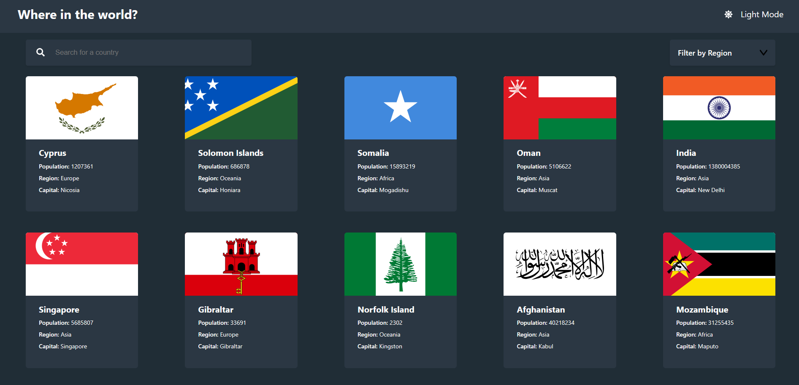

# Countries App

## About the Project

As part of the projects i am doing to broaden my js and react skills, i picked this up. Its more like a global view of the countries with a little detailed information.

## Technologies Used

- React and Friends

## UI

## License

This project is as every project licensed under [MIT](LICENSE).

## Contributions

soo welcome!!

## Known Issues

- Countries with long names have issues when they are displayed
- My search and filter components been conflicting, when i fix one the other goes south.
- Country details page is a work in progress
